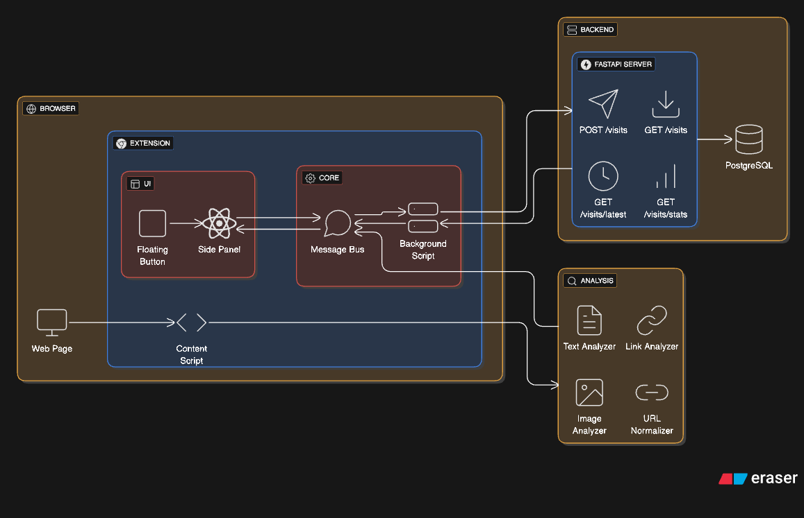

# History Sidepanel Chrome Extension

## Overview

A **fullstack Chrome extension** that displays browsing history and real-time page analytics in a side panel.
Built with **React + TypeScript (frontend)**, **FastAPI (backend)**, and **PostgreSQL (database)** — all packaged via *
*Docker**.

---

## Quick Start

### Backend & Database

```bash
cd backend
docker-compose up -d  # Starts FastAPI + PostgreSQL
```

### Chrome Extension

```bash
cd extension
npm install && npm run build
# Load the `dist/` folder as an unpacked extension in Chrome
```

---

## Troubleshooting

> ⚠️ **Note:** This extension is optimized for **Google Chrome**.
> If the side panel or other features don’t work as expected, try running it specifically
> in [Google Chrome](https://www.google.com/chrome/).

### Common Issues

| Problem              | Likely Cause         | Fix                            |
|----------------------|----------------------|--------------------------------|
| **Blank side panel** | Backend not running  | Ensure FastAPI is on port 8000 |
| **Build errors**     | Missing dependencies | Run `npm install` again        |
| **Database issues**  | Volume not persisted | Verify Docker volumes          |

---

### Debugging Tools

* Chrome **DevTools** → inspect extension UI
* **Docker logs** → backend service logs
* **Network tab** → inspect API requests

---

## Key Features

### Page Analysis

* **Text Analysis** – Content-aware word counting
* **Link Classification** – Internal vs external, with relevance filtering
* **Image Analysis** – Content vs decorative classification
* **URL Normalization** – Prevent duplicate metrics

### Real-Time Updates

* Tab switching detection
* SPA navigation support
* Live side panel refresh

---

## System Architecture



```
┌─────────────────┐    ┌──────────────────┐    ┌─────────────────┐
│   Chrome        │    │   FastAPI        │    │   PostgreSQL    │
│   Extension     │────│   Backend        │────│   Database      │
│                 │    │                  │    │                 │
│  • Side Panel   │    │  • REST API      │    │  • Visit Data   │
│  • Background   │    │  • Async I/O     │    │  • Analytics    │
│  • Content      │    │  • SQLAlchemy    │    │  • Metrics      │
└─────────────────┘    └──────────────────┘    └─────────────────┘
```

**Data Flow**

```
Page Load → Content Script → Background Worker → FastAPI → PostgreSQL  
User Action → Side Panel ← Live Updates ← Backend API
```

---

## Key Technical Decisions

| Decision                       | Rationale               | Impact                             |
|--------------------------------|-------------------------|------------------------------------|
| **FastAPI + Async SQLAlchemy** | Full async stack        | High concurrency, non-blocking I/O |
| **PostgreSQL**                 | Reliability + structure | Fast indexed lookups               |
| **Vite/Bun + React**           | Modern build tooling    | Hot reload, modular entrypoints    |
| **Event-Driven Messaging**     | Real-time UI updates    | Decoupled communication            |
| **Dockerized Services**        | Environment consistency | Easy deployment & isolation        |

---

## ⚡ Performance & Reliability

### Backend

* Async I/O with connection pooling
* Indexed URLs + timestamps for fast lookups
* Structured logging for low-latency debugging

### Extension

* Selective DOM parsing (visible elements only)
* SPA detection via MutationObserver + History API
* Debounced updates to reduce API chatter

---

## Data Model

```python
PageVisit:
- url(indexed)
- word_count
- link_count, internal_links, external_links
- image_count, content_images, decorative_images
- created_at(indexed)
```

---

## Security & Constraints

* Chrome sandbox → **isolated script execution**
* Backend runs on **localhost only**
* **No sensitive data** persisted (analytics only)
* Planned: **OAuth** & **API key validation** for remote access

---

## Core API Endpoints

| Method | Endpoint                          | Description                 |
|--------|-----------------------------------|-----------------------------|
| `POST` | `/api/v1/visits`                  | Record a page visit         |
| `GET`  | `/api/v1/visits?url={url}`        | Get visit history for a URL |
| `GET`  | `/api/v1/visits/latest?url={url}` | Fetch latest visit metrics  |
| `GET`  | `/api/v1/visits/stats`            | Aggregated site analytics   |
| `GET`  | `/api/v1/visits/recent`           | Recent page visits          |

---

## Trade-offs & Limitations

* No authentication (local-only usage)
* SPA detection may miss custom routers
* API batching not yet implemented
* Extension scripts run in isolated worlds — no shared globals

---

## Core Requirements Met

* Chrome extension with **side panel interface**
* Page visit tracking with **text, link, and image metrics**
* **FastAPI + PostgreSQL** backend
* **Dockerized** deployment with persistence
* Real-time navigation updates

---

## Enhanced Features

* **SPA Support** – Compatible with React, Vue, Angular
* **Performance Optimized** – Efficient DOM scanning & async backend
* **Production Ready** – Logging, error handling, health checks
* **Developer Friendly** – Hot reload, structured modules, rich docs

---

